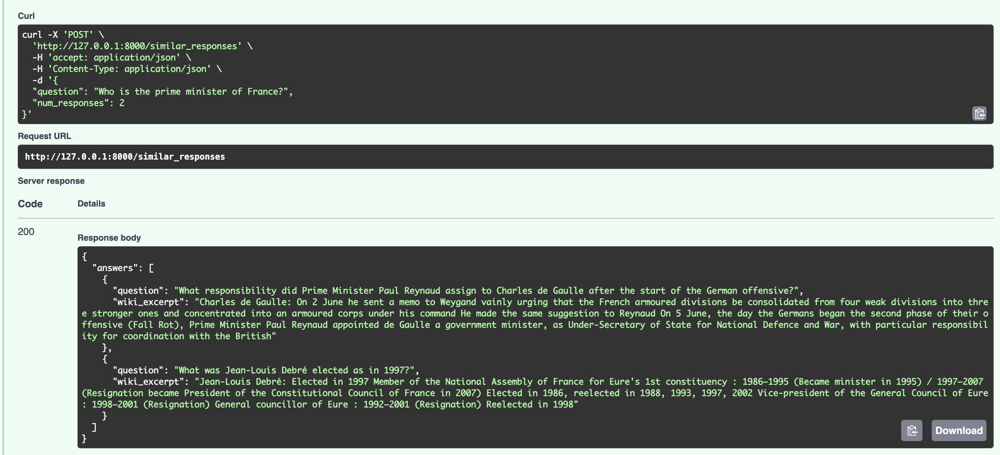
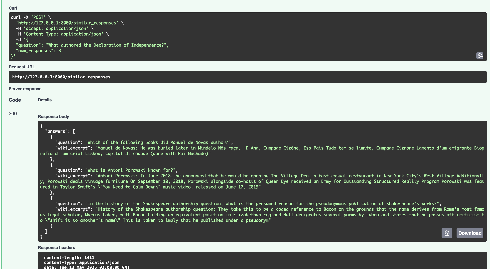
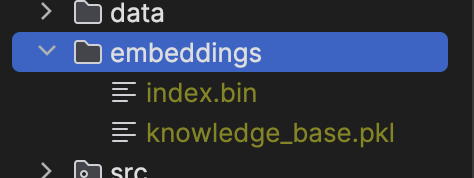
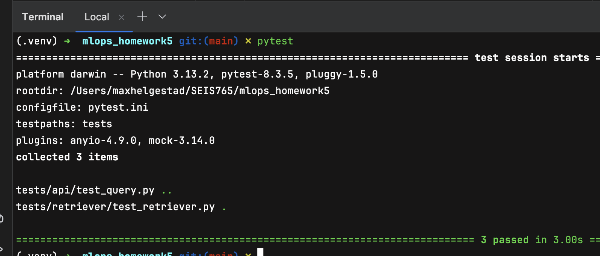

# HW 5 Demo with screenshots

## Embedding Generator - `generate_embeddings.py`
This was designed to be run like a batch job, so that's why it sits outside the main app code.
What this file does can be summarized by the following:
1. create `embeddings` directory if it doesn't exist
2. initialize the SentenceTransformer model
3. Read csv into pandas DataFrame
4. Encode questions into embeddings
5. Initialize and save Index to file
6. Save dataframe as knowledge base to pickle file

## Retrieval Endpoint - `/similar_responses`
This endpoint will retrieve a list of type RAGResponseItem, which includes a prompt and wikipedia excerpt (answer), most related to the inputted question.
You also need to add a num_responses to show the top K response items you want returned.
The pipeline of work can be summarized as follows:
1. initialize the SentenceTransformer model
2. Load index and knowledge base
3. transform question into embedding
4. use index.knn_query to find top K most similar embeddings in knowledge base
5. format data of returned labels into a list of K `RAGResponseItem`'s, including the prompt and wiki_excerpt

## Examples
Below are three screenshots of example calls I made to the endpoint.
As you can see I added a `num_responses` field to decide how many responses to get back from the query.
I wasn't sure if we were supposed to return the similar question, or the responses to the similar question, so I adjusted the `RAGResponse` class to include both.

## Embeddings
Below is the `embeddings` directory which I decided not to check into git.
It holds an index binary file, and a knowledge base pickle file.

## Pytest
I added three total pytests to the project, below you can see how to run them and that they are all passing.
I used the MockerFixture to mock functions outside the function I was trying to test. I created mock requests/responses and asserted against those.
